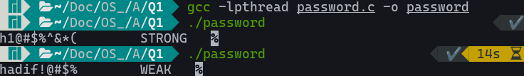

# Password Strength Calculator - Shared Memory

## Introduction

The program forks to create 3 processes, P1, P2, and P3, sharing a memory space. P1 receives a character array, password, of length 10 containing both special character as well as alphanumeric characters) from the user. P1 stores the received character array in the shared memory. P2 calculates the number of alphanumeric and special characters present. P3 then determines the strength of the password. Process P3 then communicates to Process P1 the strength of the password as `Strong` or `Weak` using the same shared memory. Here message is passed between processes using a shared memory and synchronization is done using semaphores.

## Instructions

1. Compile the program.

   ```console
   gcc -lpthread password.c -o password
   ```

2. Run the program and enter the password to test.

    ```console
    ./password
    ```

## Screenshots


