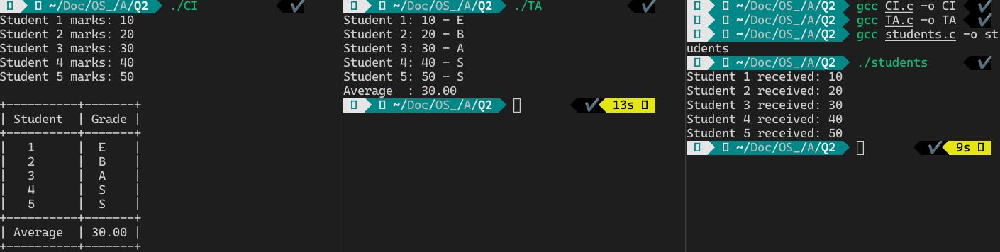

# IPC - Message Queue

## Introduction

The CI process sends the marks scored by the five students via a message queue so that only the particular student process can read his/her marks from the message queue while the TA process can read the marks of all the students. The TA process calculates the class average and assigns a grade for each student and sends it back to the CI. The student processes cannot read the class average or their grades. The access is controlled by the msg_type member in the message structure.

## Instructions

1. Compile the programs.

   ```console
   gcc CI.c -o CI
   gcc TA.c -o TA
   gcc students.c -o students
   ```

2. Run the programs in separate terminal instances so as to not mix the outputs.

    ```console
    ./CI
    ```

    ```console
    ./TA
    ```

    ```console
    ./students
    ```

## Screenshots


