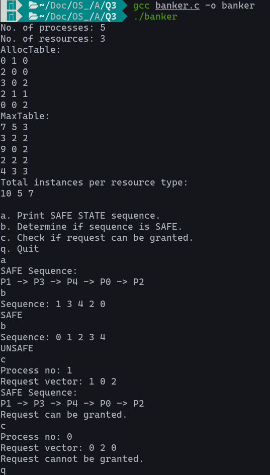

# Safe State - Bankers Algorithm

## Introduction

The program receives as input the AllocTable, MaxTable, and the total number of instances per resource type and displays a menu. Depending on the user's choice,
a. The program outputs the sequence of process that is SAFE STATE.
b. Given a sequence of processes, the program outputs whether the given sequence is in a SAFE STATE or not.
c. Given the resource request of a process, the program determines whether the request can be granted or not.
q. The program terminates.

## Instructions

1. Compile the program.

   ```console
   gcc banker.c -o banker
   ```

2. Run the program.

    ```console
    ./banker
    ```

## Screenshots


